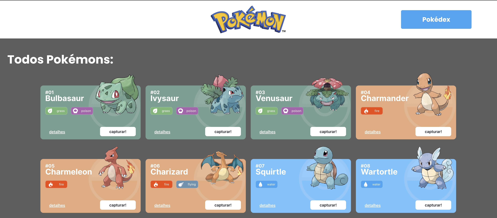

Projeto React, APIs e ChakraUI - Pokédex

  
   O Projeto Pokédex é um site de pokémons que possui três páginas: Home, Pokedex e Detalhes.

📱 Índice

Funcionalidades do Projeto
Layout
Demonstraçāo
Como rodar este projeto?
Tecnologias Utilizadas
Pessoa Autora

⚙️ Funcionalidades do Projeto

 Lista de Pokémons
 Pokédex
 Detalhes 

🏞️ Layout

  
   

  
   

  
   

💎 Demonstraçāo

href: https://github.com/

🖱️ Como rodar este projeto?

# Clone este repositório
$ git clone linkrepo

# Acesse a pasta do projeto no seu terminal
$ cd projeto-react-apis

# Instale as dependências
$ npm install

# Execute a aplicaçāo
$ npm run start

# A aplicaçāo será iniciada na porta 3000, acesse pelo navegador: http://localhost:3000/

📃 Bibliotecas Utilizadas

axios
react-router-dom
@chakra-ui/react
@emotion/react
@emotion/styled
framer-motion
@chakra-ui/icons
react-icons
@fontsource/inter
@fontsource/poppins

💻 Tecnologias

CSS - HTML - Javascript - React - React Router- Chakra-ui - Git

🤖 Autor
________________________________________________________________
🔗 [LinkedIn](https://www.linkedin.com/in/laionpereira/)
