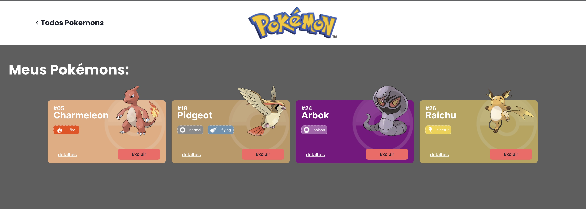

Projeto React, APIs e ChakraUI - Pokédex

  
   O Projeto Pokédex é um site de pokémons que possui três páginas: Home, Pokedex e Detalhes.

<h3>Índice</h3>

<table>
<tr>
<td>Funcionalidades do Projeto</td>
<td>Layout</td>
<td>Demonstraçāo</td>
<td>Como rodar este projeto?</td>
<td>Tecnologias Utilizadas</td>
<td>Pessoa Autora</td>
</table>

<h2>⚙️ Funcionalidades do Projeto</h2>

<table>
<td>Lista de Pokémons</td>
<td>Pokédex</td>
<td>Detalhes</td>

🏞️ Layout

  
   

  
   

  
   

💎 Demonstraçāo

href: https://github.com/

🖱️ Como rodar este projeto?

# Clone este repositório
$ git clone linkrepo

# Acesse a pasta do projeto no seu terminal
$ cd projeto-react-apis

# Instale as dependências
$ npm install

# Execute a aplicaçāo
$ npm run start

# A aplicaçāo será iniciada na porta 3000, acesse pelo navegador: http://localhost:3000/

📃 Bibliotecas Utilizadas

axios
react-router-dom
@chakra-ui/react
@emotion/react
@emotion/styled
framer-motion
@chakra-ui/icons
react-icons
@fontsource/inter
@fontsource/poppins

💻 Tecnologias

[CSS] (https://cdn-icons-png.flaticon.com/128/5968/5968242.png) -  [HTML] (https://cdn-icons-png.flaticon.com/128/5968/5968267.png) -  [Javascript] (https://cdn-icons-png.flaticon.com/128/1199/1199124.png) -  [React] (https://camo.githubusercontent.com/268ac512e333b69600eb9773a8f80b7a251f4d6149642a50a551d4798183d621/68747470733a2f2f696d672e736869656c64732e696f2f62616467652f52656163742d3230323332413f7374796c653d666f722d7468652d6261646765266c6f676f3d7265616374266c6f676f436f6c6f723d363144414642) - [React Router] (https://camo.githubusercontent.com/4f9d20f3a284d2f6634282f61f82a62e99ee9906537dc9859decfdc9efbb51ec/68747470733a2f2f696d672e736869656c64732e696f2f62616467652f52656163745f526f757465722d4341343234353f7374796c653d666f722d7468652d6261646765266c6f676f3d72656163742d726f75746572266c6f676f436f6c6f723d7768697465) [Chakra-ui](https://camo.githubusercontent.com/eeff8718189c5c5c2c8e5a5d981d49151c79db569f6056095c41bbc6684bef4b/68747470733a2f2f696d672e736869656c64732e696f2f62616467652f6368616b72615f75692d3732394639323f7374796c653d666f722d7468652d6261646765266c6f676f3d6368616b72612d7569266c6f676f436f6c6f723d7768697465) -  [Git](https://camo.githubusercontent.com/06c6858186510906c21d8c951168d55d976d7dfb9176ed6125c55b8a7de0baae/68747470733a2f2f696d672e736869656c64732e696f2f62616467652f4749542d4534344333303f7374796c653d666f722d7468652d6261646765266c6f676f3d676974266c6f676f436f6c6f723d7768697465)

🤖 Autor
________________________________________________________________
🔗 [LinkedIn](https://www.linkedin.com/in/laionpereira/)
